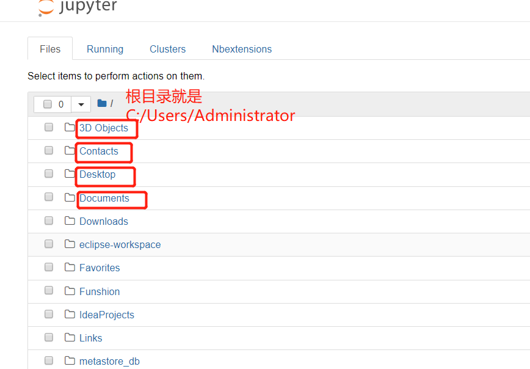
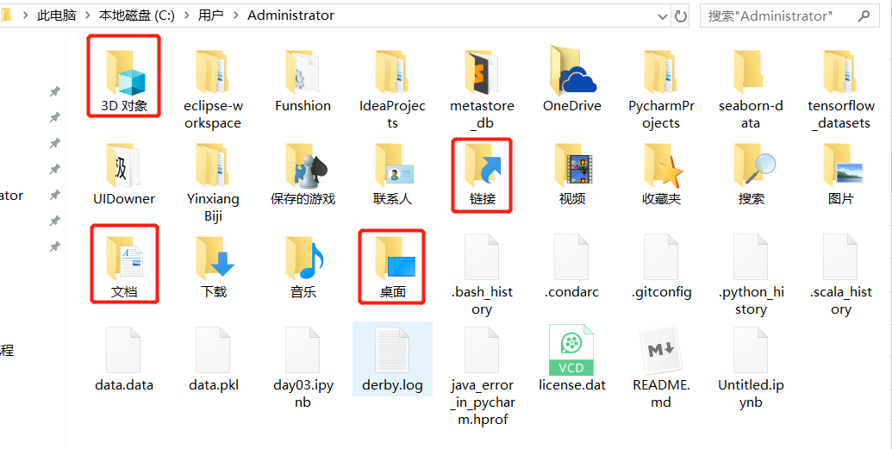
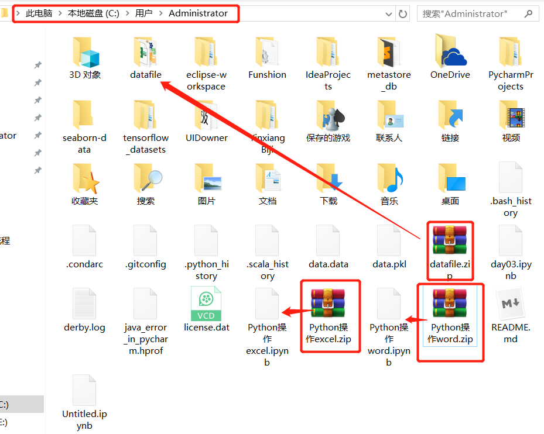
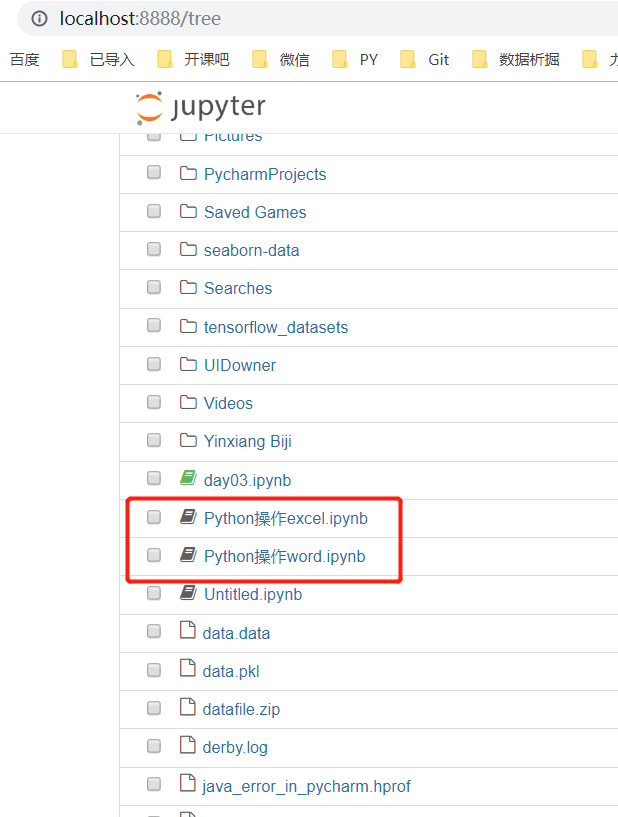
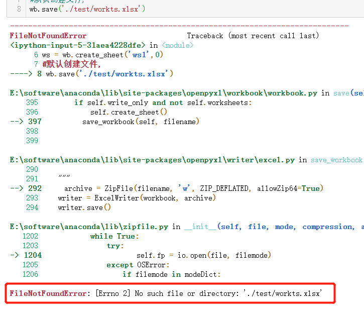
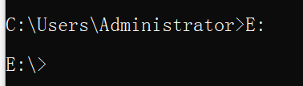
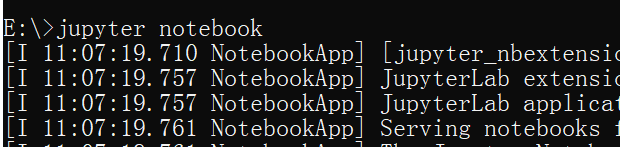
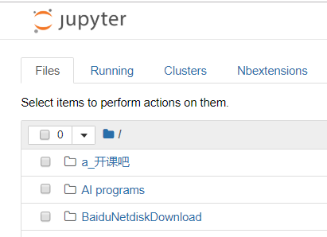
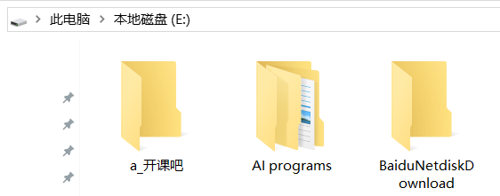

常见问题

#### 问题1

from openpyxl  import Workbook  

中Workbook第一个W要大写

#### 问题2 关于怎么使用老师的代码和文件, 路径问题

1首先查看你的jupyter默认路径, 一般默认C:/Users/Administrator
注意: 这里的Administrator可能是你自己的用户名, 更换就好

 {:width="10px" height="10px"}

上面的四个红方框一一对应, 只是有的进行翻译, 这是系统自动翻译的

2.把老师的代码和文件下载后放到 C:\Users\Administrator  下面, 并解压, 如下图

3.从jupyter页面打开对应的.ipynb格式文件

#### 问题3 目录路径不存在 (类似问题都这样解决)

当前目录(C:\Users\Administrator)下并没有test文件夹, 你自己创建一个, 然后就可以运行了

#### 问题4 C盘文件太多, 看着心乱或者是C盘空间有限, 想在其他的盘创建文件和运行

1. 首先进入cmd界面, 如下

2. 输入想放在的盘符(我这里是E盘), 如下

3. 在这里输入 jupyter notebook回车

4. 这时jupyter默认目录就是E盘

#### 问题5 想永久性修改jupyter的默认目录

参考 <https://blog.csdn.net/a857553315/article/details/103285750>

