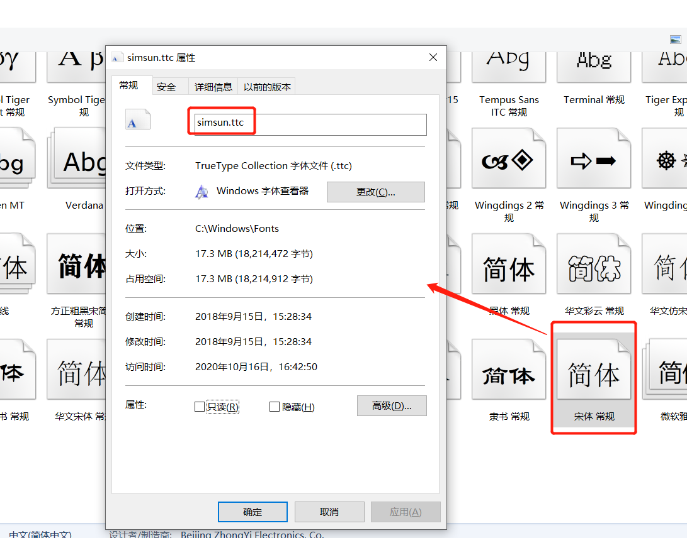

#### 问题1 

anaconda自带matplotlib,不用进行安装

#### 问题2

win系统中 字体文件的名称, 使用方法

进入 C:\Windows\Fonts 目录

选中 想要的字体文件, 右键-->属性 如下图



代码中写成下面的即可

```python
my_font = font_manager.FontProperties(fname='C:/Windows/Fonts/simsun.ttc',size=18)
```

